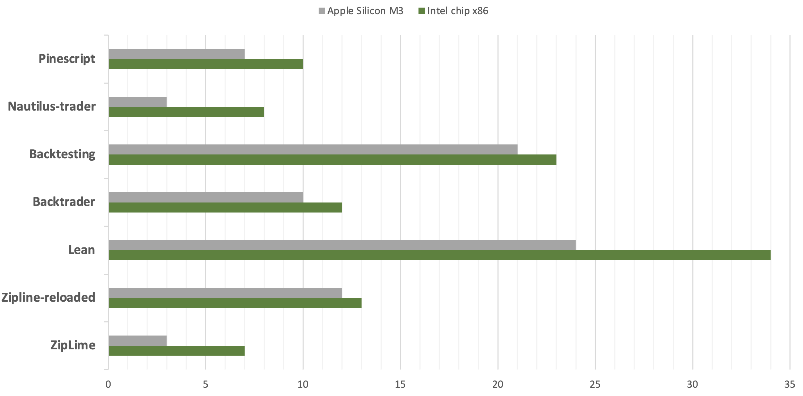

# ZipLime. The iconic backtester. Reinvented <a href='https://ziplime.limex.com'></a>

 <a target="new" href="https://pypi.python.org/pypi/ziplime"></a>
 <a target="new" href="https://pypi.python.org/pypi/ziplime"></a>
 <a target="new" href="https://pypi.python.org/pypi/ziplime"></a>
 <a target="new" href="https://github.com/Limex-com/ziplime"></a>

## Elevate Your Backtesting with Speed and Flexibility

`Ziplime` is a powerful reimagining of the classic Zipline library, now turbocharged with the speed of Polars and enhanced with a versatile new data storage architecture. Designed for quant traders and data scientists, Ziplime retains the familiar backtesting syntax of Quantopian's Zipline while introducing groundbreaking features:

- `Unmatched Performance`: Experience lightning-fast backtesting with Polars, enabling you to iterate faster and optimize strategies with ease.
- `Flexible Data Intervals`: Seamlessly integrate any data interval, from minutes to months, to match your strategy's unique requirements.
- `Comprehensive Data Support`: Go beyond price data. Incorporate fundamental data into your analyses for a more holistic view of the markets.
- `Portable`: OS independent, runs on Linux, macOS, and Windows. Deploy using Docker.
- `Live`: Use identical strategy implementations between backtesting and live deployments.

We evaluated the speed of various event-driven backtesters using a simple strategy applied to a single instrument over five years of daily data. The strategy involved entering positions based on one technical indicator and exiting based on another.



As a result, we found that ZipLime outperforms major benchmarks in terms of speed. This advantage is largely due to the internal parallelism built into Polars, which allows ZipLime to demonstrate significant performance benefits on multi-core tests, particularly on the Apple Silicon M3
## Installation

Installing Ziplime is a breeze. Simply add it to your project using Poetry:
```Bash
poetry add ziplime
```

## Usage

Ziplime is designed to provide a seamless transition from Zipline, extending its powerful capabilities with intuitive enhancement. All commands supported by `zipline` are also supported by `ziplime` with extended
list of parameters for easier usage.

### Data ingestion

Data ingestion works by first fetching historical data and then and then running live data fetch in the background. 

Difference from original zipline:

- `--start-date` and `--end-date` parameters - used to fetch bundle data only for specific date period
- `--symbols` parameter - specifies symbols to fetch data for directly in the command
- Running live data fetch in the background

Example:

Ingest data:
```Bash
poetry run python -m ziplime ingest -b lime --frequency 1m --start-date 2024-06-01 --end-date 2024-07-31 --symbols AAPL,TSLA,AMZN
```
### Strategy backtesting

Ziplime offers flexibility in how you run your backtesting. You can execute your strategies directly from the command line or within your Python scripts.

#### Run Strategy from the Command Line:
```Bash
poetry run python -m ziplime -b lime --start-date 2024-11-06 --end-date 2024-11-27 --emission-rate 1m --capital-base 100000 --benchmark-symbol AAPL -f test.py --trading-calendar NYSE --print-algo
```
#### Run Strategy Within a Python Script:

For those who prefer more control and integration within their Python projects, you can run your backtest with the following function call:
```Bash
result = run_algorithm(
    start=start_session,
    end=end_session,
    initialize=initialize,
    handle_data=handle_data,
    capital_base=1000,
    data_frequency='1d',
    bundle='ziplime')
```
This flexibility allows you to seamlessly integrate backtesting capabilities into your existing Python workflows, providing a more comprehensive and customized analytical experience

### Live trade
Still in development.
